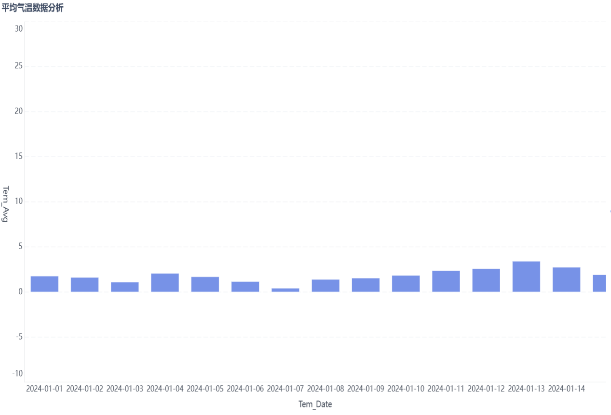
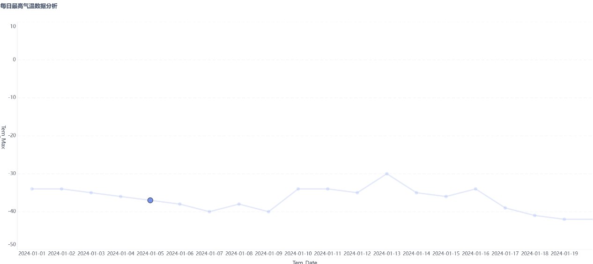
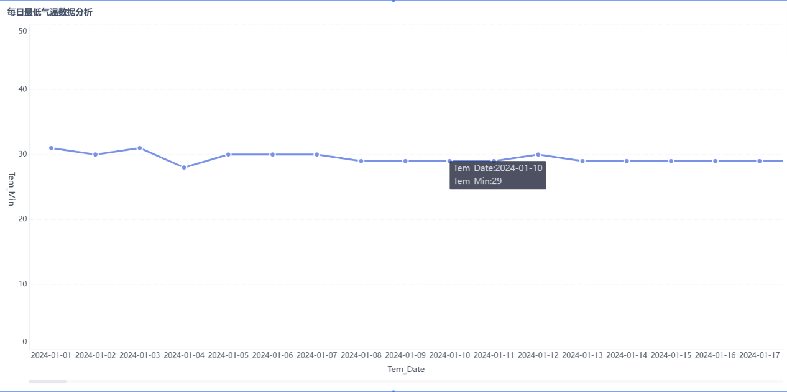
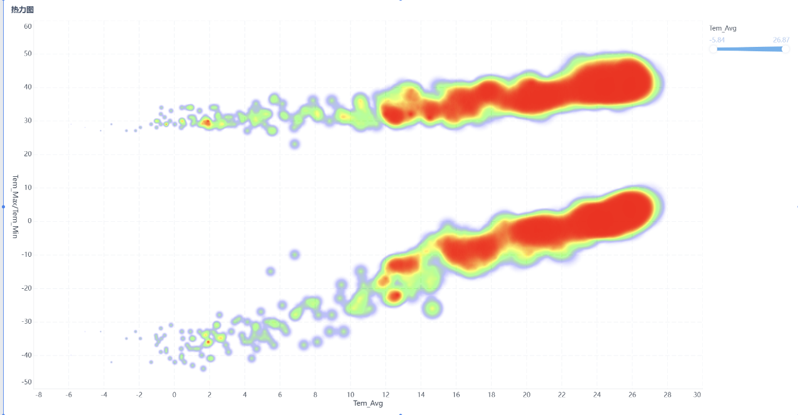

# Hadoop Weather Analysis

[](https://github.com/Yiboe/hadoop-weather-analysis/actions/workflows/ci.yml)

一个使用 Java 和 Hadoop MapReduce 处理 NOAA ISD-Lite 气象观测数据的教学型项目。程序按日期聚合空气温度，输出每日最低、最高和平均气温。

## 项目概览

这个项目适合用来演示一条最小可运行的大数据处理链路：

```text
ISD-Lite 文本数据
        │
        ▼
Mapper：解析日期和气温，过滤缺失值
        │  date -> temperature (十分之一摄氏度)
        ▼
Shuffle：按日期聚合
        │
        ▼
Reducer：计算最低值、最高值、平均值
        │
        ▼
HDFS 输出：日期<TAB>最低<TAB>最高<TAB>平均
```

当前版本重点保证 MapReduce 核心逻辑清晰、温度精度正确，并提供可重复的构建和单元测试。课程报告中涉及的 Hive、Sqoop、MySQL 和 FineBI 操作属于实验环境记录，不全部包含在本代码仓库中。

## 处理逻辑

1. 读取 ISD-Lite 每行记录的前五个字段。
2. 使用 `-9999` 识别缺失气温，并通过 Hadoop Counter 统计缺失或格式错误的行。
3. 保留原始的十分之一摄氏度整数，例如 `-227` 表示 `-22.7 °C`，避免整数除法造成负温度向 0 截断。
4. 以 `YYYY-MM-DD` 作为 Map 输出键。
5. Reducer 在原始整数精度上计算最小值、最大值和平均值，最后再格式化为摄氏度。

## 数据来源与格式

数据格式参考 [NOAA/NCEI Integrated Surface Data Lite](https://www.ncei.noaa.gov/pub/data/noaa/isd-lite/)。

| 字段 | 含义 | 单位/规则 |
| --- | --- | --- |
| 1 | 观测年份 | 年 |
| 2 | 观测月份 | 月 |
| 3 | 观测日期 | 日 |
| 4 | 观测小时 | 0–23 |
| 5 | 空气温度 | 摄氏度，缩放因子为 10，`-9999` 表示缺失 |

完整原始数据不随仓库发布。仓库仅提供一个 8 行的小型示例文件 [`examples/isd-lite-sample.txt`](examples/isd-lite-sample.txt)，避免把约 65 MB 的本地数据文件提交进 Git 历史。

需要注意：ISD-Lite 通常按“气象站—年份”保存为独立文件，记录本身不包含站点编号。如果把多个站点文件直接合并，当前程序得到的是所有输入记录混合后的每日统计，而不是某个城市或站点的统计。要进行站点级分析，应在数据采集阶段保留站点编号，并把 MapReduce 键改为“站点编号 + 日期”。

## 环境要求

- JDK 8 或更高版本
- Apache Maven 3.8 或更高版本
- Apache Hadoop 3.3.x（默认编译依赖为 3.3.6）

Hadoop 依赖使用 Maven `provided` 作用域，集群运行时由 Hadoop 环境提供，不会被重复打进项目 JAR。

## 构建与测试

```bash
mvn clean verify
```

构建成功后生成：

```text
target/hadoop-weather-analysis.jar
```

测试覆盖输入解析、缺失值识别、日期校验，以及负温度的最小值/最大值/平均值计算。

## 运行 MapReduce 作业

先将输入文件上传到 HDFS：

```bash
hdfs dfs -mkdir -p /user/$USER/weather/input
hdfs dfs -put examples/isd-lite-sample.txt /user/$USER/weather/input/
```

提交作业。输出目录必须尚不存在：

```bash
hadoop jar target/hadoop-weather-analysis.jar \
  /user/$USER/weather/input \
  /user/$USER/weather/output
```

查看结果：

```bash
hdfs dfs -cat /user/$USER/weather/output/part-r-*
```

示例文件的预期结果为：

```text
2024-01-01    -34.4   -18.4   -27.30
```

实际输出字段之间是制表符，不是空格。

如果输出目录已经存在，可以先删除它再重新运行：

```bash
hdfs dfs -rm -r /user/$USER/weather/output
```

## 实验结果展示

下面四张图来自课程报告中的 FineBI 实验结果截图，作为项目效果和可视化形式的展示。它们不是仓库示例数据的完整复现实验基准；课程报告和原始数据文件未作为公开仓库内容提交。

### 每日平均温度



### 每日最高温度



### 每日最低温度



### 温度热力图



## 项目结构

```text
src/main/java/com/sihan/weather/
├── IsdLiteParser.java          # 输入解析与缺失值识别
├── TemperatureStatistics.java  # 原始温度统计逻辑
├── WeatherMapper.java          # Map 阶段
├── WeatherReducer.java         # Reduce 阶段
└── WeatherDriver.java          # 作业入口与参数校验
src/test/java/                  # 单元测试
examples/                       # 可公开的小型输入样例
docs/figures/                   # 实验结果展示图
.github/workflows/ci.yml        # GitHub Actions
```

## 已知限制

- 当前作业只分析空气温度字段。
- 输入数据未保留站点编号时，只能生成跨全部输入记录的每日聚合结果。
- 完整数据的站点覆盖、日期连续性和质量控制需要由数据采集流程单独校验。
- 报告中的可视化图来自原课程实验环境，不能替代基于本仓库示例数据的完整基准数据集。

## 许可证

本项目代码使用 [Apache License 2.0](LICENSE)。NOAA/NCEI 数据不包含在代码许可证范围内；使用数据时请注明来源并遵守其适用条款。
